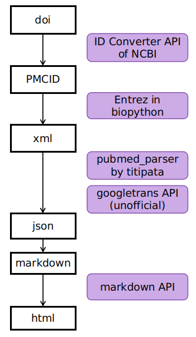

# bio_translate

bio_translate is a Python library for translating articles and tagging texts into Japanese, and output as markdown or html.  
The image below is one example of output.  

  <br>

## Table of Contents 
- [Architecture](#Architecture) 
- [Be Careful](#Be-Careful)
- [Initial Setting](#Initial-Setting)
- [Sample Program](#Sample-Program)
- [Usage](#Usage)
- [Formatting Options](#Formatting-Options)

## Architecture

The program workflow is, 
1. Convert doi (digital object identifier) into PMCID (PubMed Central ID). 
2. Fetch full texts (sometimes abstract only) in xml format with PMCID.
3. Translate texts with python googletrans API (unofficial). 
4. Format texts with markdown notation **conditioned on some keywords**. 
5. Convert markdown notation into html notation. 

  <br>

## Be Careful
Be careful about the following points.
- Read Entrez document. It requires some API limitation. 
- This module uses "googletrans" for translation from English into Japanese.  
"googletrans" is unofficial API, so the stability is not secured.
- "pubmed_parser" function will be devastated if pubmed xml formatting documentation is changed.  

Overall, if you translate the massive amout of doi, it should be carefully.

## Initial Setting 
Entrez requires e-mail address when you want to access to PMC database.  
Add `BIO_EMAIL` environment variable containing your email address.  

## Sample Program
`python main.py --csv sample.csv` will produce sample outputs.  
See files in markdon/html directory for outputs.  


"status temp" in sample.csv indicates results of the process. 
- "1" is success flag.
- "no journal" indicates PMC do not have articles of that jornal in database. 
- "abstract only" indicates output only include abstract only.


## Usage 
`python main.py -h` will show this help.

``` 
usage: main.py [-h] [--doi DOI] [--name NAME] [--csv CSV] [--open-html] [--access-doi] [--json2html]
               [--check CHECK]

Tranlate article from doi into markdown/html.

optional arguments:
  -h, --help            show this help message and exit  
  --doi DOI, -d DOI     One doi to markdon. Should be set "--name/-n" option if this is selected.  
  --name NAME, -n NAME  Name for each file. Name should be without extension. Should be set with "--  
                        name/-n" option.  
  --csv CSV             Process doi from csv. csv should include "doi" and "name" header.  
  --open-html, -o       Open tab when html are produced.  
  --access-doi, -a      Open target doi.org page when doi is not correctly converted.  
  --json2html, -j       Convert process starts from json file. If html file does not exist, raise  
                        error.  
  --check CHECK, -c CHECK  
                        List up journals used in pubmed central database. Journal data are in  
                        jlist.csv.  
```

### Options : --csv 
--csv option takes a csv file as argument.  
csv file must include the following columns: "name", "doi", "status".
- "name" column is used for naming file for xml, json, markdown, and html 
so that file extension is not needed.
- "doi" column is doi. This will be converted into PMCID.
- "status" column is used for controlling which row will be used for converting. 
In this module, if status column has nan value, the rows are used. 
If some values exist, that row is not used. 

### Options : --check 
The behavior of this option is completely different. 
The aim of this option is for checking journal is in PMC database. 
The journal list which exist in PMC database is summarized in "jlist.csv". 
This option takes argument as keyword and 
search for journal that contains the argument keyword. 

## Formatting Options
Formatting is controlled in "MDConstructor" class.   
Change class variables of "keywords" and "model_keywords" for sentence and word highlightening.   
If you want to change highligtening options, change the elements of class variables of "pipe_keywords" and "pipe_model_keywords".   

The following codes are the corresponding part of "bio_trans.py".
```python
class MDConstructor():
    keywords = ["O3", "ozone", "O 3"]
    model_keywords = ["model","Model", "regression","Regression", "モデル", "回帰"]
    pipe_keywords = [tag_wrapper.bold, tag_wrapper.purple]
    pipe_model_keywords = [tag_wrapper.italic, tag_wrapper.red]

```


